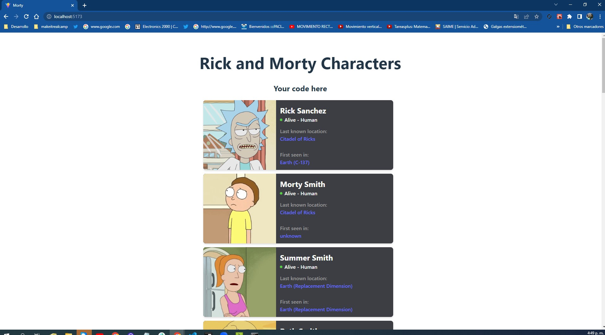

# Make It Real - Character_Card_props


se crea un proyecto en react que permita mostrar los primeros 20 personajes de la serie utilizando el mismo componente llamado CharacterCard.jsx, el componente tiene las respectivas prop-types
## Table of contents

## Table of contents

- [Overview](#overview)
  - [The challenge](#the-challenge)
  - [Screenshot](#screenshot)
- [My process](#my-process)
  - [Built with](#built-with)
  - [What I learned](#what-i-learned)
  - [Continued development](#continued-development)
  - [Useful resources](#useful-resources)
- [Author](#author)
- [Acknowledgments](#acknowledgments)


## Overview :
el proyecto tiene como objetivo crear un componente que funcione para crear varias card con props-types
-

### The challenge
-el reto fue manejar las props-types y pasar de componente al padre.





## My process

-en este proyecto creamos un componente reutilizable para futuros proyectos 

### Built with

-javascript
-DOM
-REACT
-props-types
-json()

### What I learned


We learned how to work on a project in react with use State, useEffect, components, creating an ordered api, git teamwork.

we leave part of the api example:

```js
  return (
  
      <div className="app">
        <h1>Rick and Morty Characters</h1>
        <h2>Your code here</h2>  
        <div className="container">
          {charters.map((charter,index)=>{
            return <CharacterCard
            charter= {charter}
            id={index}
            />
          })

          }
     </div>
      </div>
    )

```

### Continued development
- I will continue practicing to have a better handling of DOM, studying and consulting my mentors so that every day I improve my knowledge. about react how to handle events and improve the code as the best practice way.

 ### Useful resources
- https://classroom.makeitreal.camp/courses/82/topics/353/progress -- This helped me I will use it in the future.
-https://www.npmjs.com/package/prop-types

## Author


- Guillemro Alexander Herrera
-[github/guialexander@gmail.com]

## Acknowledgments

-I want to thank the make it real family since it has given me a new vision of my working life to improve and get out of the comfort zone and know that we can give more than what we already know
